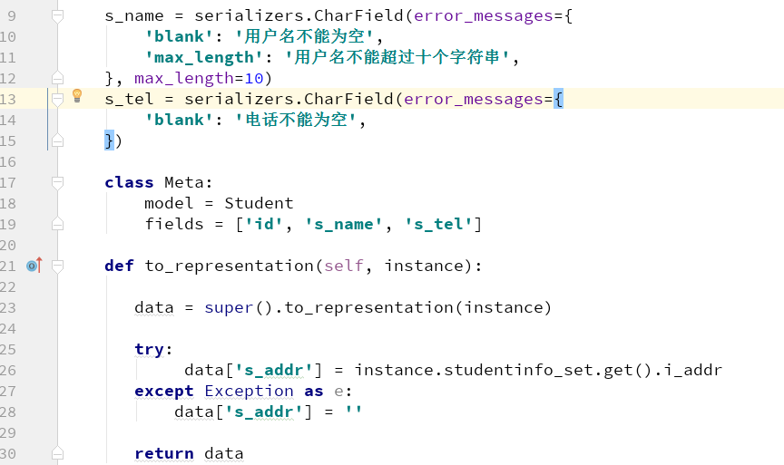

### restframework
* 要查找对象时,默认的用主键进行查找

### csf
* setting中开启 crsf设置
* 在提交表单的时候 插入 

### ajax提交delete
* 如果开启了csrfmiddle就需要在提交的时候在headers中插入
	+ csrf = $('input[name="crsmiddlewaretoken"]').val
	+ headers:{'X-CSRFToken': csrf}
* ajax更新: patch
* ajax创建: post

### ajax
	$.get('url', function(msg){}): 返回一个对象SET存储在msg中
> 如下结构:[{"id":11,"s_name":"测试1","s_tel":"12121212","s_addr":""},{"id":12,"s_name":"顺悟空","s_tel":"17897654331","s_addr":""},{"id":15,"s_name":"张三丰","s_tel":"134456778","s_addr":""}]

### 给结构包头
*  
{
	"code":0,
	"data":{"display_fields":[{"field_key":"vehicle_type","id":72,"field_name":"车型"}]},

	"msg":"请求成功"
}

* 需要继承JSONRenderer，重构render方法

### 请求错误处理信息

